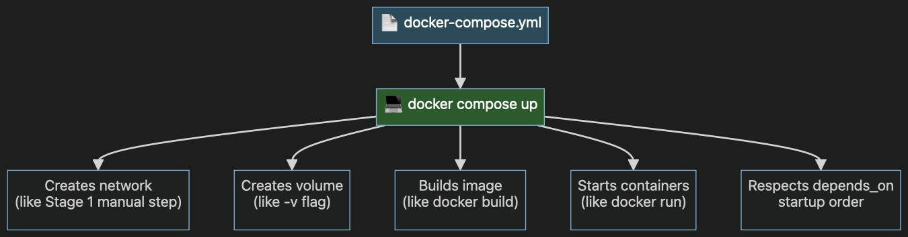
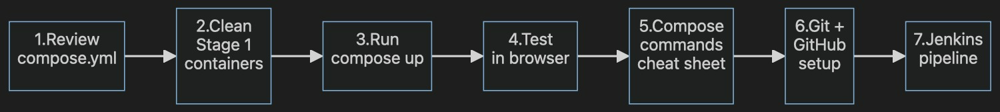
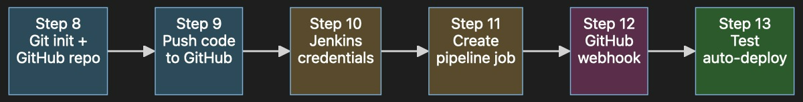

Docker build - Create image 

docker build -t devops-login-app:v1 .
docker images
docker inspect devops-login-app:latest
# create a network 
docker network create 
docker network create training-net

# 4. Start the MySQL database fresh (it will now read your init.sql)
docker run -d \
  --name db \
  --network training-net \
  -e MYSQL_ROOT_PASSWORD=rootpassword \
  -e MYSQL_DATABASE=trainingdb \
  -e MYSQL_USER=appuser \
  -e MYSQL_PASSWORD=apppassword \
  -v mysql_data:/var/lib/mysql \
  -v "$(pwd)/init.sql:/docker-entrypoint-initdb.d/init.sql:ro" \
  -p 3307:3306 \
  mysql:8.0

# See all running containers
docker ps

# Watch MySQL container startup logs to ensure it's healthy
docker logs db

# Query the database from inside the container to confirm seeding worked
docker exec -it db mysql -uappuser -papppassword trainingdb -e "SELECT * FROM users;"

# 5. Start the Flask web app container
docker run -d \
  --name web \
  --network training-net \
  -e DB_HOST=db \
  -e DB_PORT=3306 \
  -e DB_USER=appuser \
  -e DB_PASSWORD=apppassword \
  -e DB_NAME=trainingdb \
  -e SECRET_KEY="my-secret" \
  -p 5000:5000 \
  devops-login-app:v1

# check the containers 
docker ps -a 

1. Open the URL
Open your web browser and navigate to the application endpoint:
👉 http://localhost:5000

Test 1: Successful Admin Login
• Username: admin
• Password: password123
• Expected Result: The app will redirect you to http://localhost:5000/welcome. You will see a green welcome message reading: "Welcome Aboard! You have successfully logged in as: admin".

Test 2: Successful Trainee Login
• Username: trainee
• Password: training
• Expected Result: Redirects to the welcome screen showing "Welcome Aboard! You have successfully logged in as: trainee".
Test 3: Session Log Out
• Click the red "Sign Out" button on the welcome page.
• Expected Result: The session clears and immediately redirects you back to the main login page (/).
Test 4: Validation and Error Handling
• Try entering an incorrect password (e.g., username admin with password wrongpassword).
• Try leaving fields blank and hitting Sign In.
• Expected Result: The page reloads and displays a red error notice at the top saying "Invalid username or password." or "Please enter both username and password."

How to diagnose it right now
docker inspect --format='{{json .State.Health}}' web | jq

You can also inspect the standard application crash/connection logs using:
docker logs web

🚨 Reason 1: The /health route is missing in app.py
In Step 9 of your Dockerfile, we set up this healthcheck rule:
CMD curl -fs http://localhost:5000/health || exit 1
However, looking at the code for your app.py, you do not have a /health route defined. When the curl command runs inside the container, Flask responds with a 404 Not Found, which causes curl to exit with an error code and marks the container as unhealthy.
The Fix:
Add a simple health check route right above your entry point in app.py:
@app.route("/health")
def health():
    """Health check endpoint for Docker."""
    return {"status": "healthy"}, 200

# if any issue happen follow below steps 
# 1. Stop and remove the existing containers
docker rm -f db web

# 2. Completely destroy the old database volume cache
docker volume rm mysql_data

# 3. Create the network again (just in case)
docker network create training-net

# 4. Start the MySQL database fresh (it will now read your fixed init.sql)
docker run -d \
  --name db \
  --network training-net \
  -e MYSQL_ROOT_PASSWORD=rootpassword \
  -e MYSQL_DATABASE=trainingdb \
  -e MYSQL_USER=appuser \
  -e MYSQL_PASSWORD=apppassword \
  -v mysql_data:/var/lib/mysql \
  -v "$(pwd)/init.sql:/docker-entrypoint-initdb.d/init.sql:ro" \
  -p 3307:3306 \
  mysql:8.0

# 5. Rebuild your web app image to make sure the /health route is baked in
docker build -t devops-login-app:v1 .

# 6. Start the Flask web app container
docker run -d \
  --name web \
  --network training-net \
  -e DB_HOST=db \
  -e DB_PORT=3306 \
  -e DB_USER=appuser \
  -e DB_PASSWORD=apppassword \
  -e DB_NAME=trainingdb \
  -e SECRET_KEY="my-secret" \
  -p 5000:5000 \
  devops-login-app:v1

# check the users 
docker exec -it db mysql -uroot -prootpassword trainingdb -e "SELECT username, password_hash FROM users;"

# when started first time i facied the issue 
1. The Terminal Intercepted the Message
In your script, the padlock shape contained dollar signs ($).
To a Linux terminal, a $ symbol means "This is a secret system variable, change it immediately."
Because your command had names like $Fkopa... inside it, your computer thought you were asking it to replace that text with a secret system setting. Since no setting existed with that name, the terminal erased the text and replaced it with a completely blank space before passing it to the database.
2. The Database Got a Broken Padlock
Because the terminal accidentally cut out a chunk of the password hash string, the database saved a completely broken, corrupted padlock shape for the admin account.
3. The Password Mismatch
When you went to your browser and typed in the correct password (password123), the website tried to match it against that broken padlock shape inside the database. Because they didn't match up perfectly, the application rejected your login attempt and threw the "Invalid username or password" error message every time.

The Solution:
By using backslashes (\$) in our final fix, we told the terminal: "Do not touch this text. Just pass the dollar signs exactly as they are written directly to the database." The database finally saved the full, true padlock shape, allowing your password to fit perfectly and let you log in!

# add a user via a Docker command in your terminal and then immediately log in with that new user in your web browser.
# Step 1: Generate a password hash
Your web application will reject plain text passwords for security reasons. Generate a clean, uncorrupted hash string for a password (e.g., mytestpass) inside your terminal environment:

docker exec -it web python -c "from werkzeug.security import generate_password_hash; print(generate_password_hash('mahendrapass'))"

Copy the long code string that prints out.
scrypt:32768:8:1$3LwkqBYQnPDsqPHR$ffba5a76c1c8802c10f3149f5a4ccd958ad26d369e32a60ffc195bd13ea90ef675fd3f57e04979051771b0330f9aa426067c3fd58e3aa08cdbad80e14c1e4d65

# Step 2: Run the Docker command to insert the user
Run this command to insert your new user (e.g., newdevops) into MySQL. Replace PASTE_YOUR_HASH_HERE with the exact code from Step 1:

docker exec -it db mysql -uroot -prootpassword trainingdb -e "INSERT INTO users (username, password_hash) VALUES ('mahendra', 'scrypt:32768:8:1$3LwkqBYQnPDsqPHR$ffba5a76c1c8802c10f3149f5a4ccd958ad26d369e32a60ffc195bd13ea90ef675fd3f57e04979051771b0330f9aa426067c3fd58e3aa08cdbad80e14c1e4d65');"

delete the user 
docker exec -it db mysql -uroot -prootpassword trainingdb -e "DELETE FROM users WHERE username='newdevops';"

docker exec -it db mysql -uroot -prootpassword trainingdb -e "SELECT id, username, created_at FROM users;"

if faced the login issue 
The Issue: You forgot to add backslashes (\$) before the dollar signs when you executed it in your terminal. Because you didn't escape them, your Linux terminal expanded $3LwkqBYQnPDsqPHR and $ffba5... as empty variables, completely cutting them out and sending a corrupted, broken hash to MySQL. That is why the website is rejecting the password mahendrapass

issue fixed with below command
docker exec -it db mysql -uroot -prootpassword trainingdb -e "UPDATE users SET password_hash='scrypt:32768:8:1\$3LwkqBYQnPDsqPHR\$ffba5a76c1c8802c10f3149f5a4ccd958ad26d369e32a60ffc195bd13ea90ef675fd3f57e04979051771b0330f9aa426067c3fd58e3aa08cdbad80e14c1e4d65' WHERE username='mahendra';"

-----------
Step 6: Debugging - The Daily, Reality

docker ps

# which containers are running

docker ps -a

#include stopped ones

docker logs web

# see Flask output

docker logs -f db

#follow (tail -f) MySQL logs

docker exec-it web bash

#jump INSIDE the Flask container

docker exec -it db mysql -u root -p

#jump into MySQL shell

docker inspect web

# full container metadata (networks, mounts, env)

docker stats

#live CPU/memory usage

docker network inspect training-net

# which containers are on this network
Step 7: Clean Up

You'll practice:

docker stop web db

#stop containers

docker rm web db

#remove containers

docker network rm training-net

#remove network

docker volume rm mysql_data

# deletes DB data!

docker rmi devops-login-app:v1

#remove image.

Direct Test - Bypass the Browser

Test the login API directly with curl (eliminates browser entirely):

curl -i -X POST http://localhost:5000/login \
-d "username=admin" \
-d "password=password123"

What to look for:

HTTP/1.0 302 FOUND + Location: /welcome login worked!

It's a browser issue

HTTP/1.0 302 FOUND + Location: / login falled → DB or code issue

Also run the same for trainee as a control:

curl -i -X POST http://localhost:5000/login \
-d "username=trainee" \
-d "password=training"

curl -i -X POST http://localhost:5000/ \
-d "username=trainee" \
-d "password=training"

================================================

Docker Compose 

Clean Up Stage 1 Containers
# Stop & remove Stage 1 containers (if any)
docker stop db web 2>/dev/null
docker rm db web 2>/dev/null

# Remove the Stage 1 network
docker network rm training-net 2>/dev/null

# Also stop Stage 1 volume (keep this ONLY if you want to delete DB data)
# docker volume rm mysql_data 2>/dev/null

# Verify nothing is using port 5000 or 3307
docker ps

# Start everything (in background)
docker compose up -d

# Start AND rebuild images (use after code changes)
docker compose up -d --build

# Stop everything (but keep containers & volumes)
docker compose stop

# Stop AND remove containers + network (keeps volumes = DB data safe)
docker compose down

# Nuclear option: remove containers + network + volumes (wipes DB!)
docker compose down -v

# See all running services
docker compose ps

# View logs (all services, follow mode)
docker compose logs -f

# Logs for just one service
docker compose logs -f web

# Jump inside the web container
docker compose exec web bash

# Run a one-off command
docker compose exec db mysql -uappuser -papppassword trainingdb -e "SELECT * FROM users;"

# Restart just one service
docker compose restart web

# Scale a service to N replicas (not for stateful services like DB)
docker compose up -d --scale web=3   # ⚠️ port conflict unless you remove port mapping

Test in Browser

Open: http://localhost:5000

  • Try trainee / training → welcome page 🎉
  • Try admin / password123 → welcome page 🎉 (hopefully this time!)

# Force Docker to rebuild the web image and spin up the containers in detached mode
docker compose up -d --build web