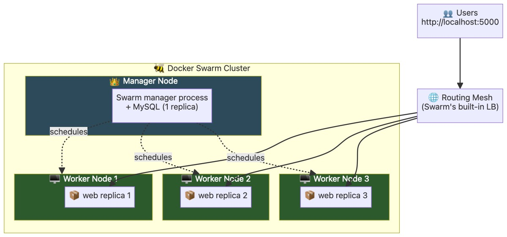
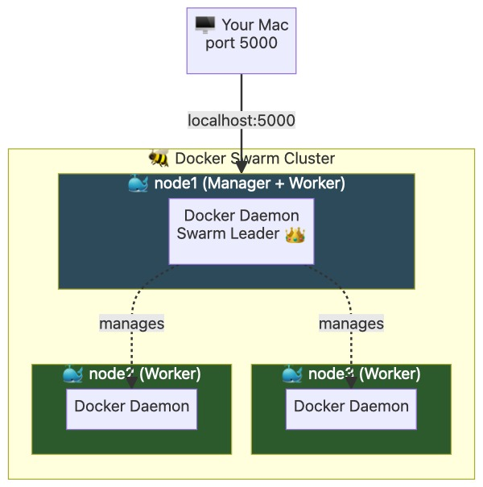
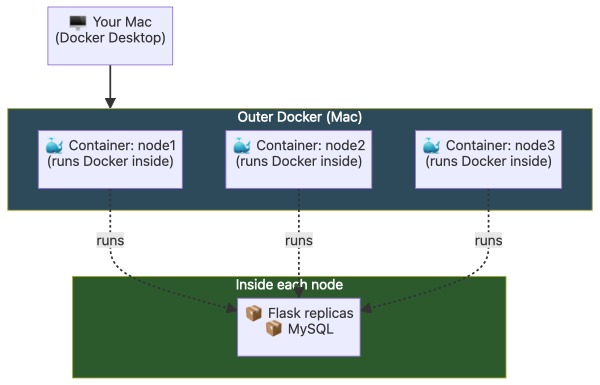
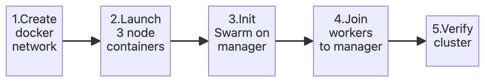

Docker Swarm 

Capability	             Compose	    Swarm
Run multiple containers	     ✅	✅
Multiple hosts (cluster)	   ❌	✅
Replicas (horizontal scaling)	❌	✅
Auto-restart failed containers	✅	✅
Auto-restart on another host if host dies	❌	✅
Rolling updates (zero downtime)	❌	✅
Built-in load balancer	❌	✅
Secrets management	❌	✅
Overlay networks (across hosts)	❌	✅

Term	What it is	Analogy
Node	A machine (physical/VM) in the cluster	A worker bee
Manager node	Node that controls the cluster	Queen bee 👑
Worker node	Node that runs containers	Worker bee 🐝
Service	A declaration like "run 3 copies of web app"	A job description
Task	An actual running container instance	An employee doing the job
Stack	A group of related services	A whole department
Overlay network	Virtual network spanning multiple hosts	A phone line between offices
Secret	Encrypted credential/config	A password in a vault

docker swarm init                        # Make this node a manager
docker swarm join-token worker           # Get token to add workers
docker swarm join --token <TOKEN> <MGR>  # (on worker) Join cluster
docker node ls                           # List all nodes
docker node demote <node-id>             # Make manager → worker

2. Services vs Containers

In Compose: you define containers directly.
In Swarm: you define a service (desired state) → Swarm creates tasks (containers) to match.

# Swarm creates 3 tasks (containers) on 3 nodes

4. Rolling Updates

docker service update --image myapp:v2 web

docker-stack.yml

# Initialize
docker swarm init

Launch 3 "Node" Containers

# create the docker network 

docker network create swarm-lab

# Node 1 — will become the Swarm manager
docker run -d --privileged --name node1 \
  --hostname node1 \
  --network swarm-lab \
  -p 5000:5000 \
  docker:dind
or 

docker run -d --privileged --name node1 \
  --hostname node1 \
  --network swarm-lab \
  -p 5000:5000 -p 7000:7000 \
  docker:dind

# Node 2 — worker
docker run -d --privileged --name node2 \
  --hostname node2 \
  --network swarm-lab \
  docker:dind

# Node 3 — worker
docker run -d --privileged --name node3 \
  --hostname node3 \
  --network swarm-lab \
  docker:dind

Swarm initialized: current node (xyz1234abc) is now a manager.

To add a manager to this swarm, run 'docker swarm join-token manager'.
docker exec -it node1 docker swarm init

docker exec node1 docker swarm join-token worker

or 
docker exec -it node1 docker swarm init --advertise-addr node1
# Initialize swarm
docker exec -it node1 docker swarm init --advertise-addr $(docker exec node1 ip route get 1.1.1.1 | awk '{print $7; exit}')

To add a worker to this swarm, run the following command:

    docker swarm join --token SWMTKN-1-5pxxxx-xxxx 172.18.0.2:2377
or 
# Join Worker 1
docker exec -it node2 <PASTE_YOUR_JOIN_COMMAND_HERE>

# Join Worker 2
docker exec -it node3 <PASTE_YOUR_JOIN_COMMAND_HERE>

OR 

Using the token from Step 4, run the join command inside each worker:

# Get the join command (easier than copy-pasting)
JOIN_CMD=$(docker exec node1 docker swarm join-token worker | grep "docker swarm join")
echo "Join command: $JOIN_CMD"

# Have node2 run it
docker exec node2 sh -c "$JOIN_CMD"

# Have node3 run it
docker exec node3 sh -c "$JOIN_CMD"

docker exec node1 docker node ls

# Deploy nginx with 3 replicas

docker exec node1 docker service create --name hello --replicas 3 --publish 8100:80 nginx:alpine
sleep 5

# Wait a few seconds, then see where the replicas landed
docker exec node1 docker service ps hello

docker exec node1 docker service rm hello

# docker visulizer , run inside of the master node 
$ docker service create \
  --name=viz \
  --publish=7000:8080/tcp \
  --constraint=node.role==manager \
  --mount=type=bind,src=/var/run/docker.sock,dst=/var/run/docker.sock \
  dockersamples/visualizer

  or 

docker exec -it node1 docker service create \
  --name viz \
  --publish 7000:8080 \
  --constraint node.role==manager \
  --mount type=bind,source=/var/run/docker.sock,target=/var/run/docker.sock \
  dockersamples/visualizer:latest

http://localhost:7000

docker exec -it node1 docker service ps viz

docker exec -it node1 docker service rm viz

---

# Copy the file using your correct name

docker cp docker-stack.yml node1:/docker-stack.yml

#  Set up your Swarm Secrets
docker exec -it node1 sh -c 'echo "apppassword" | docker secret create db_password -'
docker exec -it node1 sh -c 'echo "rootpassword" | docker secret create mysql_root_password -'

#  Deploy the Stack with the correct file path
docker exec -it node1 docker stack deploy -c /docker-stack.yml login-system

# Verification 

docker exec -it node1 docker stack ps login-system

docker exec -it node1 docker service logs -f login-system_web

 docker exec -it node1 docker service ls

 Commands:
  create      Create a new service
  inspect     Display detailed information on one or more services
  logs        Fetch the logs of a service or task
  ls          List services
  ps          List the tasks of one or more services
  rm          Remove one or more services
  rollback    Revert changes to a service's configuration
  scale       Scale one or multiple replicated services
  update      Update a service

if any issue happen removed the master 
docker rm -f node1

docker exec -it node2 docker swarm leave --force
docker exec -it node3 docker swarm leave --force
# Initialize swarm

docker exec -it node1 docker swarm init --advertise-addr $(docker exec node1 ip route get 1.1.1.1 | awk '{print $7; exit}')

# Fire up the visualizer correctly on port 7000
docker exec -it node1 docker service create \
  --name viz \
  --publish 7000:8080 \
  --constraint node.role==manager \
  --mount type=bind,source=/var/run/docker.sock,target=/var/run/docker.sock \
  dockersamples/visualizer:latest

login issue came then check this way 

Manually Run the Table Creation
docker exec -i node1 sh -c "docker exec -i \$(docker ps -q -f name=login-system_db) mysql -uroot -prootpassword trainingdb" < init.sql

docker exec -it node1 sh -c "docker exec -i \$(docker ps -q -f name=login-system_db) mysql -uroot -prootpassword trainingdb -e \"SELECT username, password_hash FROM users;\""

http://localhost:5000 and log in with your admin profile:
• Username: admin
• Password: password123

Remove the Node Containers
docker rm -f node1 node2 node3
Remove the Lab Private Network
docker network rm swarm-lab

docker system prune -f
docker volume prune -f

